# Infraestructura 3: VPN de acceso remoto (SSL-VPN) con FortiGate

**Autor:** Omar Paulino
**Matrícula:** 20251325
**Plataforma:** GNS3, FortiGate VM 7.0.9, Cisco c2691 (IOS 12.4), Cisco IOSvL2, Ubuntu Cloud 24.04

---

## Video de demostración

https://youtu.be/XMXFRB_LSAM?si=qNiALX3KupV_ovs0

En el video muestro:

- El Usuario abre el servidor web por HTTPS **sin VPN**.
- El SSH al servidor **falla sin VPN**.
- Al conectar la SSL-VPN con `openfortivpn`, el SSH **funciona**.
- Al desconectar la VPN, el SSH vuelve a fallar mientras la web sigue funcionando.

---

## Contenido

1. [Propósito de la práctica](#1-propósito-de-la-práctica)
2. [Qué cambié respecto a la Infraestructura 2](#2-qué-cambié-respecto-a-la-infraestructura-2)
3. [Topología](#3-topología)
4. [Direccionamiento IP y redes](#4-direccionamiento-ip-y-redes)
5. [Cableado en GNS3](#5-cableado-en-gns3)
6. [Switches](#6-switches)
7. [Router Cisco R1-1325](#7-router-cisco-r1-1325)
8. [FortiGate FMW2-1325](#8-fortigate-fmw2-1325)
9. [Servidor Web](#9-servidor-web)
10. [Usuario y cliente SSL-VPN](#10-usuario-y-cliente-ssl-vpn)
11. [Verificación del funcionamiento](#11-verificación-del-funcionamiento)
---

## 1. Propósito de la práctica

El objetivo de esta práctica fue implementar una **VPN de acceso remoto (Remote-Site)** con la **SSL-VPN del FortiGate**, y separar qué servicios del servidor son públicos y cuáles solo se alcanzan a través de la VPN:

- **El servidor web (HTTPS, puerto 443) es público.** Lo publiqué en la IP pública del FortiGate con una IP virtual (VIP), así que el Usuario lo abre sin VPN.
- **El SSH (puerto 22) es privado.** No está publicado en Internet. Solo se puede usar desde dentro del túnel SSL-VPN, después de autenticarse con un usuario del grupo de la VPN.

A diferencia de las Infraestructuras 1 y 2, aquí no hay un túnel permanente entre dos sitios. Es **el propio Usuario el que abre el túnel** desde su equipo con un cliente VPN cuando lo necesita, como haría un empleado que trabaja desde casa.

### Requisitos y cómo los cumplí

| Requisito | Cómo lo cumplí |
| --- | --- |
| Un FortiGate configurado por GUI | FMW2-1325: VIP, direcciones, usuario, grupo, portal, ajustes de SSL-VPN y políticas, todo por GUI |
| VPN Remote-Site entre el cliente y el servidor | SSL-VPN en modo túnel en el puerto 10443 de la IP pública `200.25.13.25`; cliente `openfortivpn` en el Usuario |
| Un equipo de red Cisco | Router c2691 `R1-1325`: VLAN 10, DHCP, ruta por defecto y NAT |
| ISP con IP públicas | Switch IOSvL2-1 + NAT1; IP públicas simuladas `200.25.13.13` (router) y `200.25.13.25` (FortiGate) |
| Servidor Web en una /28 con HTTPS y SSH | Ubuntu con Apache + SSL y OpenSSH, usuario `omar`, en `10.13.25.130/28` |
| Usuario en una /25, VLAN 10, DHCP y traceroute | Ubuntu en la VLAN 10 con IP por DHCP del router; `traceroute` al servidor con y sin VPN |
| Acceso web sin VPN | VIP `VIP-WEB-HTTPS` + política `WEB-PUBLICO-HTTPS` (solo HTTPS) |
| Acceso SSH solo por VPN | Política `SSLVPN-A-SERVIDOR`: desde `ssl.root`, pool de la VPN y grupo `GRUPO-VPN-1325` |

---

## 2. Qué cambié respecto a la Infraestructura 2

Partí del proyecto de la Infraestructura 2 (router Cisco + FortiGate) y lo transformé de VPN sitio a sitio a VPN de acceso remoto.

| Elemento | Cambio |
| --- | --- |
| Router R1-1325 | Le quité toda la VPN sitio a sitio (crypto map, transform-set, ISAKMP, ACL `VPN-TRAFICO`) y la excepción de NAT hacia el servidor. Ahora solo da red, DHCP y NAT |
| FMW2-1325 | Borré la VPN sitio a sitio (túnel, rutas, políticas y objetos). Creé la VIP del servidor web, la SSL-VPN, el usuario, el grupo y las políticas nuevas |
| WebServer | Activé el SSH con contraseña y creé el usuario `omar` |
| Usuario | Liberé espacio en disco e instalé el cliente `openfortivpn` |
| Webterm del Sitio 2 | Lo borré y lo creé de nuevo, porque no abría |
| NAT1 y switches | Sin cambios |

---

## 3. Topología

### Topología en GNS3

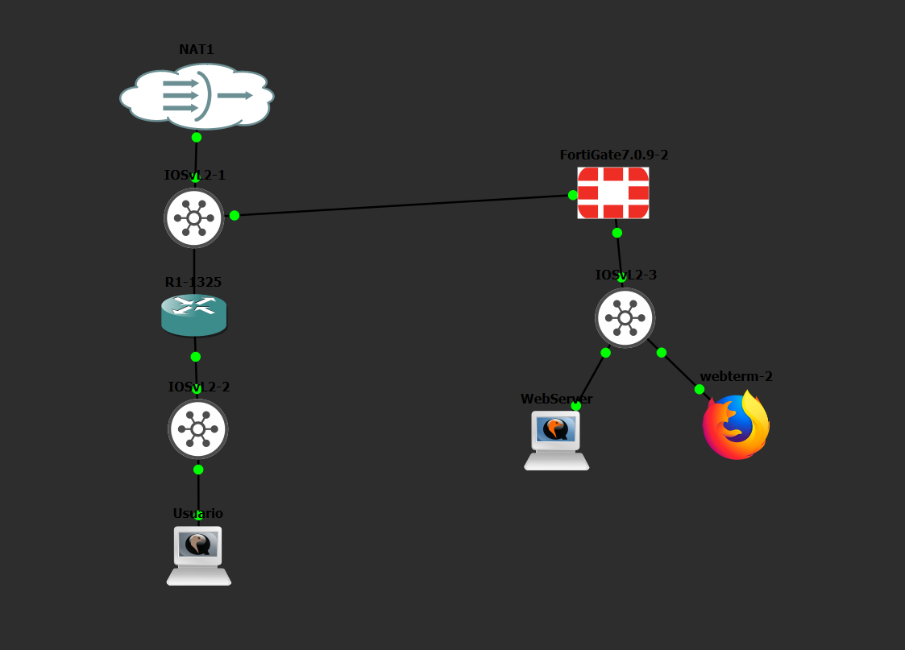

### Diagrama lógico

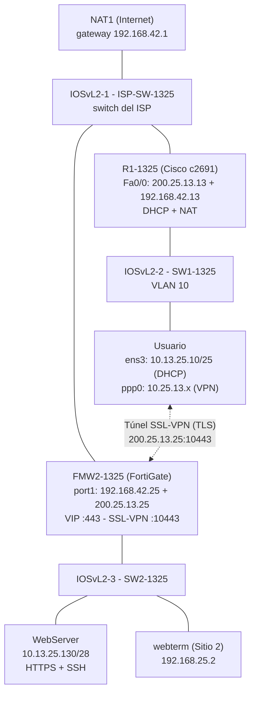

### Los caminos del Usuario hacia el servidor

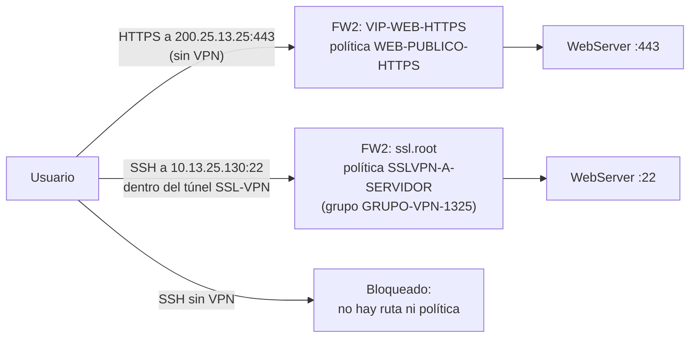

---

## 4. Direccionamiento IP y redes

El direccionamiento sigue derivado de mi matrícula **2025-1325**. Para el pool de la VPN usé `10.25.13.x`, que no se solapa con ninguna red de la topología.

### 4.1 Redes

| Red | Máscara | VLAN | Gateway | Uso |
| --- | --- | --- | --- | --- |
| 10.13.25.0/25 | 255.255.255.128 | 10 | 10.13.25.1 (R1-1325) | Usuarios del Sitio 1, con DHCP del router |
| 10.13.25.128/28 | 255.255.255.240 | sin VLAN | 10.13.25.129 (FMW2-1325) | Servidor Web |
| 10.25.13.10 – 10.25.13.20 | rango | — | — | **Pool de IP para los clientes de la SSL-VPN** |
| 200.25.13.0/27 | 255.255.255.224 | — | — | IP públicas simuladas |
| 192.168.42.0/24 | 255.255.255.0 | — | 192.168.42.1 (NAT1) | Salida real a Internet |
| 192.168.25.0/24 | 255.255.255.0 | sin VLAN | 192.168.25.1 (FMW2-1325) | Gestión del FortiGate |

### 4.2 Direcciones por equipo

| Equipo | Interfaz | Dirección IP | Uso |
| --- | --- | --- | --- |
| R1-1325 | FastEthernet0/0 (principal) | 200.25.13.13/27 | IP pública simulada |
| R1-1325 | FastEthernet0/0 (secundaria) | 192.168.42.13/24 | Salida a Internet por NAT1 |
| R1-1325 | FastEthernet0/1.10 (dot1Q 10) | 10.13.25.1/25 | Gateway y DHCP de la VLAN 10 |
| FMW2-1325 | port1 (principal) | 192.168.42.25/24 | Salida a Internet |
| FMW2-1325 | port1 (secundaria) | 200.25.13.25/27 | **IP pública: VIP del servidor web y SSL-VPN** |
| FMW2-1325 | port2 (principal) | 192.168.25.1/24 | Gestión por GUI |
| FMW2-1325 | port2 (secundaria) | 10.13.25.129/28 | Gateway del Servidor Web |
| FMW2-1325 | ssl.root | — | Interfaz virtual de la SSL-VPN |
| Usuario | ens3 | 10.13.25.10/25 (DHCP) | Red local |
| Usuario | ppp0 (solo con la VPN conectada) | 10.25.13.x (del pool) | Interfaz del túnel SSL-VPN |
| WebServer | ens3 | 10.13.25.130/28 (fija) | HTTPS y SSH |
| webterm (Sitio 2) | eth0 | 192.168.25.2/24 (fija) | Acceso a la GUI del FortiGate |

### 4.3 Datos de la VPN y de los accesos

| Dato | Valor |
| --- | --- |
| Servidor web publicado | `https://200.25.13.25` (puerto 443) → `10.13.25.130:443` |
| Servidor SSL-VPN | `200.25.13.25`, puerto **10443** (el 443 ya lo usa la VIP) |
| Usuario de la VPN | `omar-vpn` / `Vpn2025-1325` |
| Grupo de la VPN | `GRUPO-VPN-1325` |
| Portal | `PORTAL-1325`, modo túnel con split tunneling |
| Usuario SSH del servidor | `omar` / `Omar2025-1325` |

---

## 5. Cableado en GNS3

| Desde | Puerto | Hasta | Puerto |
| --- | --- | --- | --- |
| NAT1 | nat0 | IOSvL2-1 (ISP-SW-1325) | Gi0/0 |
| IOSvL2-1 | Gi0/1 | R1-1325 | FastEthernet0/0 |
| IOSvL2-1 | Gi0/2 | FMW2-1325 | port1 |
| R1-1325 | FastEthernet0/1 | IOSvL2-2 (SW1-1325) | Gi0/0 |
| IOSvL2-2 | Gi0/1 | Usuario | e0 (ens3) |
| FMW2-1325 | port2 | IOSvL2-3 (SW2-1325) | Gi0/0 |
| IOSvL2-3 | Gi0/1 | WebServer | e0 (ens3) |
| IOSvL2-3 | Gi0/2 | webterm (Sitio 2) | eth0 |

---

## 6. Switches

Los tres switches quedaron **igual que en las Infraestructuras 1 y 2**. Los comandos están en [`scripts/switches/`](scripts/switches/) y los running-configs en [`running-configs/`](running-configs/).

| Switch | Puerto | Descripción | Modo |
| --- | --- | --- | --- |
| ISP-SW-1325 | Gi0/0 | Hacia NAT1 | access, VLAN 1 |
| ISP-SW-1325 | Gi0/1 | Hacia la WAN del router | access, VLAN 1, portfast edge |
| ISP-SW-1325 | Gi0/2 | Hacia FW2 port1 | access, VLAN 1, portfast edge |
| SW1-1325 | Gi0/0 | Troncal hacia el router | trunk 802.1Q, permitidas 10,99, nativa 99, nonegotiate |
| SW1-1325 | Gi0/1 | Usuario | access, VLAN 10, portfast edge |
| SW1-1325 | Gi0/2 | Sin equipo | access, VLAN 99 |
| SW2-1325 | Gi0/0 | Hacia FW2 port2 | access, VLAN 1, portfast edge |
| SW2-1325 | Gi0/1 | WebServer | access, VLAN 1, portfast edge |
| SW2-1325 | Gi0/2 | webterm | access, VLAN 1, portfast edge |

La VLAN 10 viaja etiquetada por la troncal de SW1 hasta la subinterfaz `FastEthernet0/1.10` del router.

---

## 7. Router Cisco R1-1325

En esta práctica el router **ya no participa en la VPN**. Su función es dar al Usuario una red con DHCP y salida a Internet por NAT, como haría el router de la casa u oficina de un empleado remoto.

Lo configuré por CLI. Los scripts están en [`scripts/router/`](scripts/router/) y el running-config en [`running-configs/R1-1325.txt`](running-configs/R1-1325.txt).

### 7.1 Quitar la VPN sitio a sitio de la Infraestructura 2

```
configure terminal
interface FastEthernet0/0
 no crypto map CMAP-1325
 exit
no crypto map CMAP-1325 10
no crypto ipsec transform-set TS-1325
no crypto isakmp key Vpn#20251325 address 200.25.13.25
no crypto isakmp policy 10
no crypto isakmp keepalive
no ip access-list extended VPN-TRAFICO
!
ip access-list extended NAT-USUARIOS
 no deny ip 10.13.25.0 0.0.0.127 10.13.25.128 0.0.0.15
 exit
end
clear crypto sa
clear crypto isakmp
write memory
```

- Primero quité el crypto map de la interfaz, porque IOS no deja borrar un crypto map que está aplicado.
- La línea `deny` de la ACL de NAT la puse en la Infraestructura 2 para que el tráfico hacia el servidor no se tradujera y entrara en la VPN. Ahora ya no hace falta: todo el tráfico del Usuario hacia afuera, incluida la conexión SSL-VPN, debe salir traducido.

### 7.2 Interfaces

| Interfaz | Configuración | Explicación |
| --- | --- | --- |
| Fa0/0 | `200.25.13.13/27` principal + `192.168.42.13/24` secundaria, `ip nat outside` | WAN del router, lado externo del NAT |
| Fa0/1 | Sin IP | Solo transporta la troncal |
| Fa0/1.10 | `encapsulation dot1Q 10`, `10.13.25.1/25`, `ip nat inside` | Gateway de la VLAN 10, lado interno del NAT |

```
interface FastEthernet0/0
 description WAN hacia ISP (IOSvL2-1)
 ip address 192.168.42.13 255.255.255.0 secondary
 ip address 200.25.13.13 255.255.255.224
 ip nat outside
!
interface FastEthernet0/1
 description LAN troncal hacia IOSvL2-2
 no ip address
!
interface FastEthernet0/1.10
 description VLAN10 USUARIOS
 encapsulation dot1Q 10
 ip address 10.13.25.1 255.255.255.128
 ip nat inside
```

### 7.3 DHCP para la VLAN 10

```
ip dhcp excluded-address 10.13.25.1 10.13.25.9
ip dhcp excluded-address 10.13.25.101 10.13.25.127
!
ip dhcp pool VLAN10-USUARIOS
 network 10.13.25.0 255.255.255.128
 default-router 10.13.25.1
 dns-server 8.8.8.8 1.1.1.1
```

El router entrega las IP de la `.10` a la `.100`, con gateway `10.13.25.1` y DNS 8.8.8.8 / 1.1.1.1.

### 7.4 Ruta por defecto

```
ip route 0.0.0.0 0.0.0.0 192.168.42.1
```

El router tiene además dos redes conectadas en Fa0/0: `192.168.42.0/24` y `200.25.13.0/27`. Por eso **llega directamente a la IP pública del FortiGate (`200.25.13.25`)** por el switch del ISP, sin pasar por NAT1. Así viajan tanto el HTTPS público como la conexión SSL-VPN.

### 7.5 NAT (PAT)

```
ip access-list extended NAT-USUARIOS
 permit ip 10.13.25.0 0.0.0.127 any
!
ip nat pool SALIDA-INTERNET 192.168.42.13 192.168.42.13 netmask 255.255.255.0
ip nat inside source list NAT-USUARIOS pool SALIDA-INTERNET overload
```

| Elemento | Explicación |
| --- | --- |
| ACL `NAT-USUARIOS` | Ahora traduce **todo** lo que sale de la VLAN 10, sin excepciones |
| Pool `SALIDA-INTERNET` | Una sola IP, `192.168.42.13`, la que NAT1 sabe devolver |
| `overload` | PAT: todos los usuarios comparten esa IP con puertos distintos |

El FortiGate ve llegar al Usuario con la IP `192.168.42.13`. Le responde por su red conectada `192.168.42.0/24`, y el router deshace la traducción.

### 7.6 Verificación

```
show running-config
show ip interface brief
show ip route
show ip dhcp binding
show ip nat translations
show crypto map
```

`show crypto map` no devuelve nada, lo que confirma que el router ya no tiene VPN.

---

## 8. FortiGate FMW2-1325

Toda la configuración del FortiGate la hice **de forma gráfica (GUI)** desde el navegador del webterm, entrando a `http://192.168.25.1`. El único paso por CLI fue darle la IP inicial a `port2` en la Infraestructura 1.

El running-config en texto está en [`running-configs/FMW2-1325.conf`](running-configs/FMW2-1325.conf). En [`scripts/fortigate/02_FW2_equivalente_cli.fos`](scripts/fortigate/02_FW2_equivalente_cli.fos) dejé el equivalente en CLI de todo lo que hice por GUI.

### 8.1 Quitar la VPN sitio a sitio

El FortiGate no deja borrar un objeto que otro objeto está usando, así que lo borré en este orden:

1. *Policy & Objects → Firewall Policy*: `vpn_VPN-SITIO1_local_0` y `vpn_VPN-SITIO1_remote_0`.
2. *Network → Static Routes*: la ruta por la interfaz `VPN-SITIO1` y la ruta Blackhole hacia `10.13.25.0/25`.
3. *VPN → IPsec Tunnels*: el túnel `VPN-SITIO1`.
4. *Policy & Objects → Addresses*: los grupos `VPN-SITIO1_local` y `VPN-SITIO1_remote`, y después `VPN-SITIO1_local_subnet_1` y `VPN-SITIO1_remote_subnet_1`.

El objeto `SSLVPN_TUNNEL_ADDR1` viene de fábrica en FortiOS y no lo toqué.

### 8.2 System → Settings

| Campo | Valor |
| --- | --- |
| Hostname | `FMW2-1325` |
| Time zone | GMT-4 (Santo Domingo) |

### 8.3 Network → Interfaces

| Interfaz | Alias | Rol | IP principal | IP secundaria | Administrative Access |
| --- | --- | --- | --- | --- | --- |
| port1 | WAN-ISP | Undefined | 192.168.42.25/24 | 200.25.13.25/27 (PING) | PING |
| port2 | LAN-SITIO2 | LAN | 192.168.25.1/24 | 10.13.25.129/28 (PING) | PING, HTTPS, HTTP |
| ssl.root | — | — | — | — | Interfaz virtual que FortiOS crea para la SSL-VPN |

En la WAN dejé **solo PING**. El FortiGate no acepta administración (HTTPS/SSH) desde Internet; lo único que expone en `200.25.13.25` es la VIP del servidor web (443) y la SSL-VPN (10443).

### 8.4 Network → DNS

| Primario | Secundario |
| --- | --- |
| 8.8.8.8 | 1.1.1.1 |

### 8.5 Network → Static Routes

| # | Destino | Gateway | Interfaz | Distancia |
| --- | --- | --- | --- | --- |
| 1 | 0.0.0.0/0 | 192.168.42.1 | port1 (WAN-ISP) | 10 |

Es la única ruta estática. No hace falta ninguna ruta hacia el pool de la VPN (`10.25.13.10–20`): el FortiGate sabe por sí mismo que esas IP están detrás de la interfaz `ssl.root` mientras haya clientes conectados.

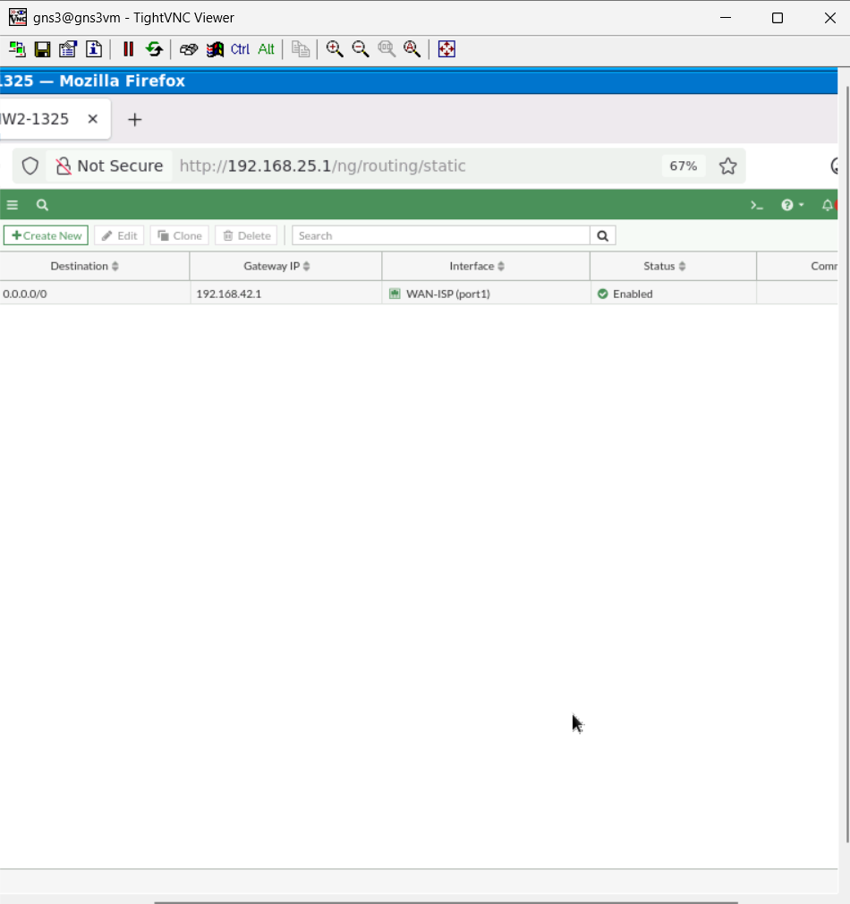

### 8.6 Publicar el servidor web: Virtual IP

*Policy & Objects → Virtual IPs → Create New → Virtual IP*:

| Campo | Valor |
| --- | --- |
| Name | `VIP-WEB-HTTPS` |
| Interface | port1 (WAN-ISP) |
| Type | Static NAT |
| External IP address | 200.25.13.25 |
| Map to IPv4 address | 10.13.25.130 |
| Port Forwarding | Activado, protocolo TCP |
| External service port | 443 |
| Map to IPv4 port | 443 |

La VIP hace **NAT de destino**: cuando llega una conexión a `200.25.13.25:443`, el FortiGate cambia el destino a `10.13.25.130:443`. Con *Port Forwarding* solo se publica el puerto 443, así que **el puerto 22 del servidor no queda expuesto**.

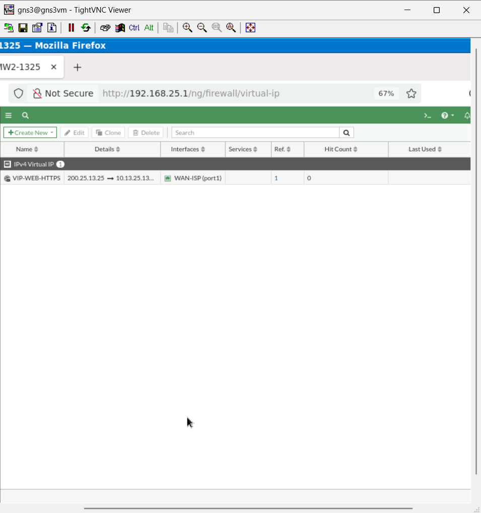

### 8.7 Policy & Objects → Addresses

| Nombre | Tipo | Valor | Uso |
| --- | --- | --- | --- |
| LAN-SERVIDOR | Subnet | 10.13.25.128/28 | Red del servidor (de la Infraestructura 1) |
| VPN-POOL-1325 | IP Range | 10.25.13.10 – 10.25.13.20 | IP que reciben los clientes de la SSL-VPN |

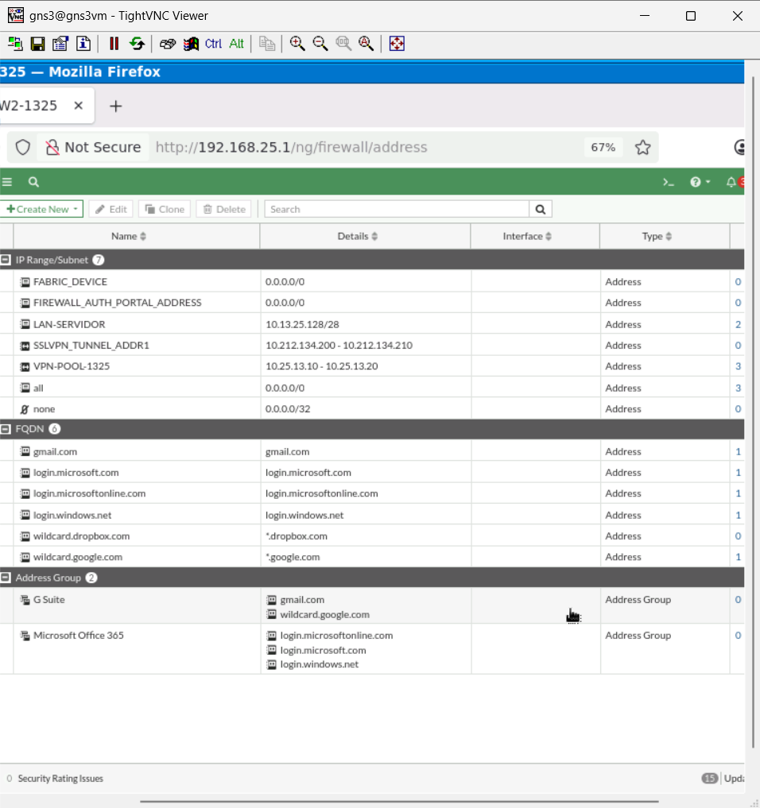

### 8.8 Usuario y grupo de la VPN

*User & Authentication → User Definition → Create New → Local User*:

| Campo | Valor |
| --- | --- |
| Username | `omar-vpn` |
| Password | `Vpn2025-1325` |
| User account status | Enabled |

*User & Authentication → User Groups → Create New*:

| Campo | Valor |
| --- | --- |
| Name | `GRUPO-VPN-1325` |
| Type | Firewall |
| Members | `omar-vpn` |

El grupo es lo que conecta todo: el mapping de la SSL-VPN le asigna el portal y la política de firewall exige pertenecer a él para dejar pasar el tráfico.

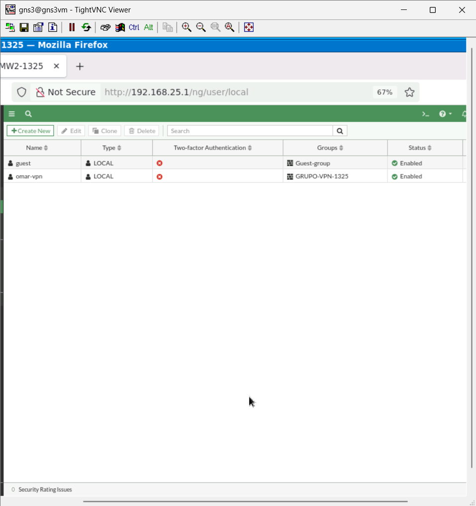

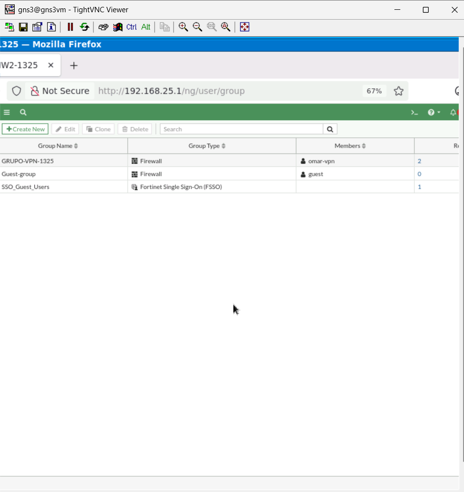

### 8.9 Portal SSL-VPN

*VPN → SSL-VPN Portals → Create New*:

| Campo | Valor | Explicación |
| --- | --- | --- |
| Name | `PORTAL-1325` | |
| Tunnel Mode | Activado | El cliente obtiene una interfaz de red (`ppp0`) y puede usar cualquier protocolo, como SSH |
| Enable Split Tunneling | Enabled Based on Policy Destination | Solo el tráfico hacia los destinos de la política (`10.13.25.128/28`) va por el túnel; Internet sigue saliendo por la red local del Usuario |
| Source IP Pools | `VPN-POOL-1325` | De aquí sale la IP del cliente |
| Enable Web mode | Desactivado | No uso el portal web del navegador, solo el modo túnel |

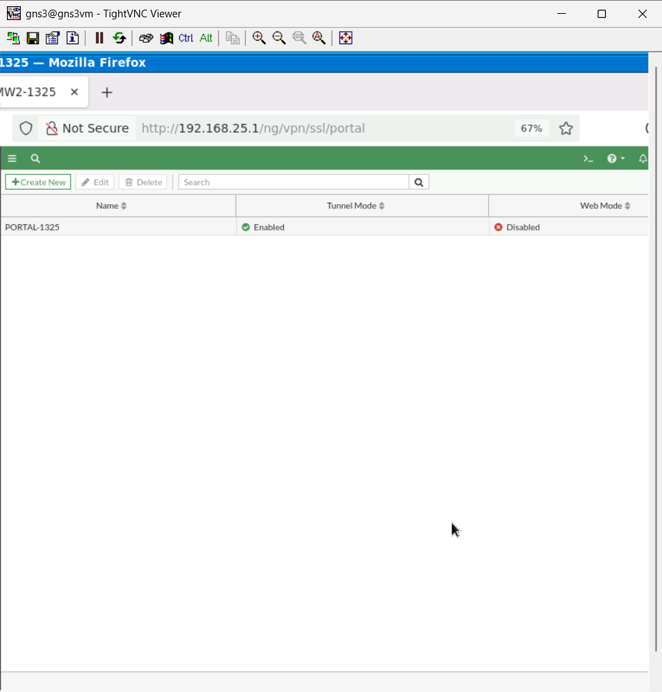

### 8.10 Ajustes de la SSL-VPN

*VPN → SSL-VPN Settings*:

| Campo | Valor | Explicación |
| --- | --- | --- |
| Listen on Interface(s) | port1 (WAN-ISP) | La VPN escucha en la WAN |
| Listen on Port | **10443** | El 443 ya lo usa la VIP del servidor web |
| Restrict Access | Allow access from any host | Cualquier IP de Internet puede intentar conectarse; luego tiene que autenticarse |
| Server Certificate | Fortinet_Factory | Certificado autofirmado de fábrica del FortiGate |
| Address Range | Specify custom IP ranges: `VPN-POOL-1325` | |
| Authentication/Portal Mapping | `GRUPO-VPN-1325` → `PORTAL-1325` | Los usuarios del grupo reciben este portal |
| All Other Users/Groups | `PORTAL-1325` | Es obligatorio elegir un portal por defecto; este FortiGate no tenía los portales de fábrica `web-access` / `full-access` |

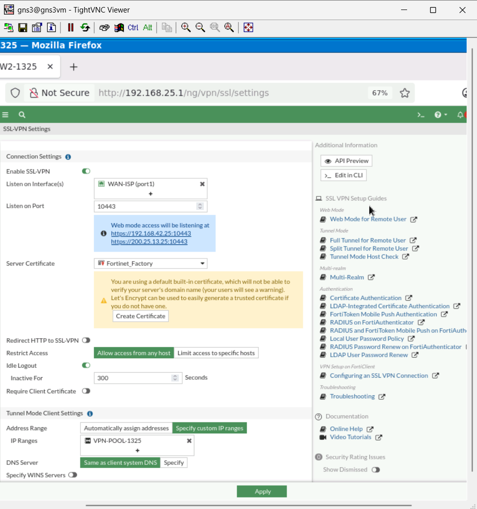

### 8.11 Policy & Objects → Firewall Policy

| # | Nombre | Entrada | Salida | Origen | Destino | Servicio | Acción | NAT | Log |
| --- | --- | --- | --- | --- | --- | --- | --- | --- | --- |
| 1 | SERVIDOR-INTERNET | port2 (LAN-SITIO2) | port1 (WAN-ISP) | LAN-SERVIDOR | all | ALL | ACCEPT | Enabled | All Sessions |
| 2 | WEB-PUBLICO-HTTPS | port1 (WAN-ISP) | port2 (LAN-SITIO2) | all | VIP-WEB-HTTPS | HTTPS | ACCEPT | Disabled | All Sessions |
| 3 | SSLVPN-A-SERVIDOR | SSL-VPN tunnel interface (ssl.root) | port2 (LAN-SITIO2) | VPN-POOL-1325 + grupo GRUPO-VPN-1325 | LAN-SERVIDOR | HTTPS, PING, SSH, TRACEROUTE | ACCEPT | Disabled | All Sessions |
| — | Implicit Deny | any | any | all | all | ALL | DENY | — | — |

**Explicación de cada regla:**

- **SERVIDOR-INTERNET (NAT de origen):** permite que el servidor salga a Internet traducido a `192.168.42.25`. La usé para instalar paquetes.
- **WEB-PUBLICO-HTTPS (acceso sin VPN):** deja entrar desde Internet solo el servicio **HTTPS** hacia la VIP. No necesita NAT activado porque la propia VIP ya hace la traducción de destino.
- **SSLVPN-A-SERVIDOR (acceso por VPN):** es la regla que cumple el objetivo de la práctica. Solo acepta tráfico que:
  - entra por la interfaz del túnel `ssl.root`,
  - viene de una IP del pool `VPN-POOL-1325`,
  - pertenece a un usuario autenticado del grupo `GRUPO-VPN-1325`,
  - va hacia la red del servidor.

  Es la **única** política que permite **SSH**. Sin NAT, el servidor ve la IP real del cliente VPN (`10.25.13.x`).
- **Implicit Deny:** todo lo demás se bloquea. Por eso el SSH desde fuera del túnel no tiene ninguna política que lo permita.

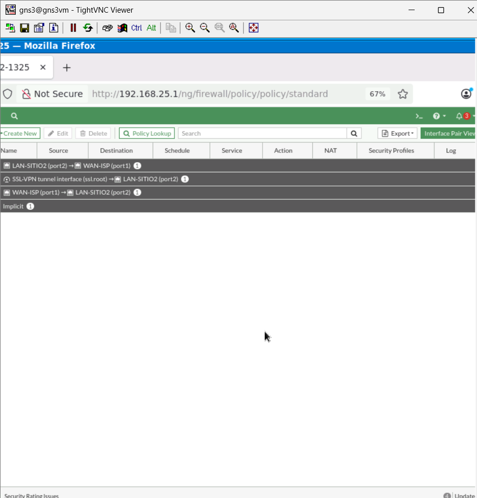

### 8.12 Running-config de la SSL-VPN

```
config firewall vip
    edit "VIP-WEB-HTTPS"
        set extip 200.25.13.25
        set mappedip "10.13.25.130"
        set extintf "port1"
        set portforward enable
        set extport 443
        set mappedport 443
    next
end

config vpn ssl web portal
    edit "PORTAL-1325"
        set tunnel-mode enable
        set ipv6-tunnel-mode enable
        set ip-pools "VPN-POOL-1325"
        set ipv6-pools "SSLVPN_TUNNEL_IPv6_ADDR1"
    next
end

config vpn ssl settings
    set servercert "Fortinet_Factory"
    set tunnel-ip-pools "VPN-POOL-1325"
    set source-interface "port1"
    set source-address "all"
    set source-address6 "all"
    set default-portal "PORTAL-1325"
    config authentication-rule
        edit 1
            set groups "GRUPO-VPN-1325"
            set portal "PORTAL-1325"
        next
    end
end
```

FortiOS no muestra los valores por defecto. Por eso no aparecen el puerto `10443`, el split tunneling activado ni el web mode desactivado. `ipv6-tunnel-mode` y el pool IPv6 los activó la GUI automáticamente; en esta práctica no uso IPv6.

---

## 9. Servidor Web

**Imagen:** Ubuntu Cloud 24.04, hostname `WEBSERVER-1325`.

### 9.1 Red (sin cambios)

| Parámetro | Valor |
| --- | --- |
| IP | 10.13.25.130/28 (fija con netplan) |
| Gateway | 10.13.25.129 (FMW2-1325) |
| DNS | 8.8.8.8 y 1.1.1.1 |
| MTU | 1400 |

```yaml
network:
  version: 2
  ethernets:
    ens3:
      dhcp4: false
      addresses: [10.13.25.130/28]
      mtu: 1400
      routes:
        - to: default
          via: 10.13.25.129
      nameservers:
        addresses: [8.8.8.8, 1.1.1.1]
```

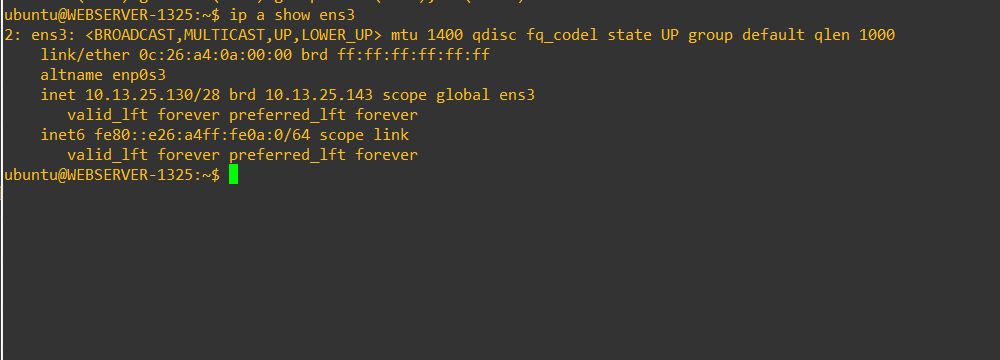

### 9.2 Apache con HTTPS (sin cambios)

Igual que en la Infraestructura 1: Apache con `a2enmod ssl` y el sitio `default-ssl`, con el certificado autofirmado de Ubuntu. La página es:

```html
<h1>Servidor Web - Sitio 2 - Omar Paulino 20251325</h1>
```

### 9.3 SSH con contraseña y usuario `omar`

```bash
sudo systemctl status ssh --no-pager
sudo adduser omar                      # contraseña: Omar2025-1325
echo 'PasswordAuthentication yes' | sudo tee /etc/ssh/sshd_config.d/01-lab.conf
sudo systemctl restart ssh
```

Verificación:

```
ubuntu@WEBSERVER-1325:~$ cat /etc/ssh/sshd_config.d/01-lab.conf
PasswordAuthentication yes

ubuntu@WEBSERVER-1325:~$ id omar
uid=1001(omar) gid=1001(omar) groups=1001(omar),100(users)
```

- **Por qué el archivo se llama `01-lab.conf`:** la imagen cloud de Ubuntu trae un archivo en `/etc/ssh/sshd_config.d/` con `PasswordAuthentication no`. OpenSSH lee esos archivos en orden alfabético y **se queda con el primer valor que encuentra** de cada opción. Con el prefijo `01-` mi archivo se lee primero y activa el acceso con contraseña.
- El usuario `omar` es un usuario normal del sistema (uid 1001); no es administrador.

---

## 10. Usuario y cliente SSL-VPN

**Imagen:** Ubuntu Cloud 24.04.

### 10.1 Red

El Usuario recibe la red por **DHCP** del router:

| Parámetro | Valor |
| --- | --- |
| IP | 10.13.25.10/25 |
| Gateway | 10.13.25.1 (R1-1325) |
| DNS | 8.8.8.8 y 1.1.1.1 |

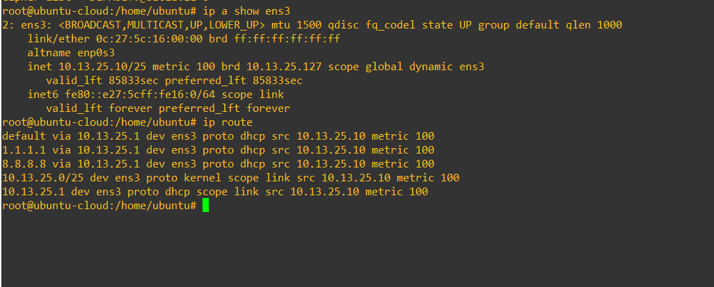

### 10.2 Liberar espacio en disco

La instalación del cliente VPN falló con `No space left on device`. El disco de la imagen cloud es de 2.4 GB y estaba al 98%. Además, apt intentaba instalar un kernel nuevo (`6.8.0-142`) que no cabía; el kernel en uso era `6.8.0-45-generic`.

```bash
df -h /
uname -r
sudo apt clean
sudo journalctl --vacuum-size=20M          # liberó 101.5 MB
dpkg -l | grep 6.8.0-142
sudo apt purge -y linux-image-6.8.0-142-generic linux-modules-6.8.0-142-generic \
  linux-headers-6.8.0-142 linux-headers-6.8.0-142-generic \
  linux-tools-6.8.0-142 linux-tools-6.8.0-142-generic \
  linux-virtual linux-image-virtual linux-headers-virtual linux-headers-generic
sudo apt -f install
sudo apt autoremove --purge -y
sudo apt clean
df -h /
```

Purgué el kernel pendiente y sus metapaquetes (`linux-virtual`, etc.), que son los que obligan a instalar cada kernel nuevo. El kernel en uso no se tocó.

### 10.3 Instalar el cliente

```bash
sudo apt install -y openfortivpn traceroute
```

`openfortivpn` es un cliente de código abierto compatible con la SSL-VPN de FortiGate. Hace lo mismo que FortiClient, pero desde la terminal.

### 10.4 Configuración del cliente

El primer intento de conexión fallaba con `tlsv1 alert protocol version`. La licencia de evaluación de FortiOS 7.0.9 solo ofrece versiones y cifrados de TLS antiguos, y Ubuntu 24.04 los bloquea por defecto. En la CLI del FortiGate, `config vpn ssl settings` no ofrecía las opciones `ssl-min-proto-ver` / `ssl-max-proto-ver`, así que lo resolví del lado del cliente.

El comando que funcionó fue:

```bash
sudo openfortivpn 200.25.13.25:10443 -u omar-vpn --insecure-ssl --min-tls=1.0 --cipher-list=DEFAULT:@SECLEVEL=0
```

| Opción | Explicación |
| --- | --- |
| `200.25.13.25:10443` | IP pública del FortiGate y puerto de la SSL-VPN |
| `-u omar-vpn` | Usuario local del FortiGate |
| `--insecure-ssl` | Permite protocolos y cifrados que openfortivpn desactiva por inseguros |
| `--min-tls=1.0` | Acepta TLS desde la versión 1.0 |
| `--cipher-list=DEFAULT:@SECLEVEL=0` | Baja el nivel de seguridad de OpenSSL para aceptar los cifrados del FortiGate de evaluación |

La primera conexión mostró la huella SHA-256 del certificado del FortiGate, que es autofirmado. La agregué como certificado de confianza (`trusted-cert`).

Para no escribir todo cada vez, guardé la configuración en `/etc/openfortivpn/config`:

```
### configuration file for openfortivpn, see man openfortivpn(1) ###

host = 200.25.13.25
port = 10443
username = omar-vpn
password = Vpn2025-1325
trusted-cert = 286efc05555bc05560acbbb14928b35b93b7da0e6a47e1a6701bc983704f1190
insecure-ssl = 1
min-tls = 1.0
cipher-list = DEFAULT:@SECLEVEL=0
```

Con este archivo basta con ejecutar `sudo openfortivpn`. Con una licencia completa de FortiGate (TLS 1.2/1.3) no harían falta las opciones de TLS inseguro.

### 10.5 Qué pasa al conectarse

1. El Usuario abre una conexión TLS a `200.25.13.25:10443`. El router la traduce a `192.168.42.13` y la entrega al FortiGate por el switch del ISP.
2. El FortiGate valida `omar-vpn` contra el grupo `GRUPO-VPN-1325` y le asigna el portal `PORTAL-1325`.
3. El cliente crea la interfaz **`ppp0`** con una IP del pool (`10.25.13.10–20`).
4. Por el split tunneling, el cliente añade **solo la ruta `10.13.25.128/28` por `ppp0`**. El resto del tráfico (Internet) sigue saliendo por `ens3`.
5. El tráfico hacia el servidor viaja cifrado dentro del TLS, sale del túnel en el FortiGate por `ssl.root` y la política `SSLVPN-A-SERVIDOR` lo deja pasar.

---

## 11. Verificación del funcionamiento

Las pruebas completas están en el [video](#video-de-demostración). Los comandos están en [`scripts/hosts/pruebas_usuario.sh`](scripts/hosts/pruebas_usuario.sh).

### 11.1 Sin VPN: la web sí, el SSH no

```bash
curl -k https://200.25.13.25
sudo traceroute -I 200.25.13.25
ssh -o ConnectTimeout=5 omar@10.13.25.130
ssh -o ConnectTimeout=5 omar@200.25.13.25
```

| Prueba | Resultado esperado | Por qué |
| --- | --- | --- |
| `curl -k https://200.25.13.25` | Devuelve la página del servidor | VIP + política `WEB-PUBLICO-HTTPS` |
| `sudo traceroute -I 200.25.13.25` | `10.13.25.1` → `200.25.13.25` | El router llega directo a la IP pública del FortiGate |
| `ssh omar@10.13.25.130` | Connection timed out | El Usuario no tiene ruta hacia la red del servidor; sale por NAT1 a Internet y se pierde |
| `ssh omar@200.25.13.25` | Connection timed out | La VIP solo publica el 443 y la WAN no permite administración por SSH |

### 11.2 Con VPN: el SSH funciona

```bash
sudo openfortivpn            # en una consola; queda en primer plano
```

En otra consola:

```bash
ip a show ppp0
ip route | grep ppp0
sudo traceroute -I 10.13.25.130
ssh omar@10.13.25.130
```

| Prueba | Resultado esperado |
| --- | --- |
| openfortivpn | `Tunnel is up and running.` |
| `ip a show ppp0` | IP del pool `10.25.13.x` |
| `ip route \| grep ppp0` | `10.13.25.128/28 dev ppp0` (split tunnel) |
| traceroute | Llega a `10.13.25.130` por el túnel |
| `ssh omar@10.13.25.130` | Pide la contraseña y entra al servidor (`omar@WEBSERVER-1325`) |
| FortiGate: *Dashboard → Network → SSL-VPN* | `omar-vpn` conectado con su IP del pool |

### 11.3 VPN desconectada otra vez

```bash
sudo pkill openfortivpn      # o Ctrl+C en la consola de la VPN
ssh -o ConnectTimeout=5 omar@10.13.25.130
curl -k https://200.25.13.25
```

| Prueba | Resultado esperado |
| --- | --- |
| `ssh omar@10.13.25.130` | Connection timed out: desaparecen `ppp0` y su ruta |
| `curl -k https://200.25.13.25` | Sigue funcionando: la web no depende de la VPN |
